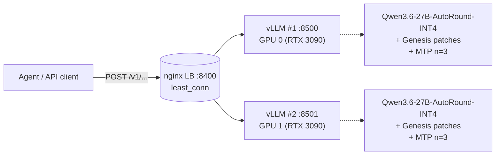
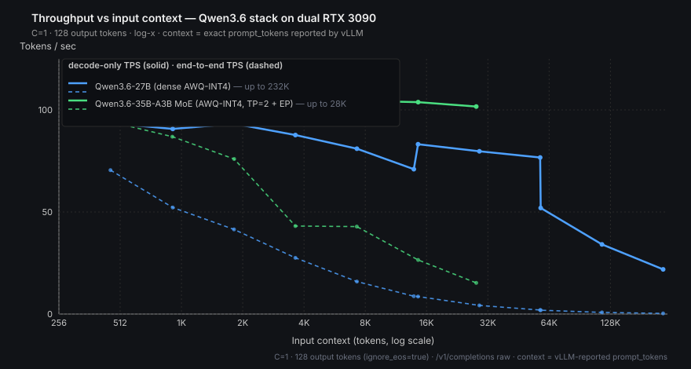

# From 25 to 283 tok/s: Serving Qwen3.6 on Dual RTX 3090s

A full-stack tour of two single-endpoint optimization rounds on the same hardware — first the **27B dense** (9× over baseline, 225 tok/s aggregate), then the **35B-A3B MoE** (peak 283 tok/s aggregate, with completely different bottlenecks).

> **TL;DR.** On dual RTX 3090s we built two production stacks and benchmarked both:
> **Round 1 — Qwen3.6-27B (dense)**: from 25 → 100 tok/s single-stream / 225 tok/s aggregate at C=4 via 2 replicas behind nginx, MTP n=5 speculative decoding, Sandermage's Genesis patches.
> **Round 2 — Qwen3.6-35B-A3B (MoE)**: 283 tok/s aggregate at C=4 via TP=2 + expert-parallel — *no* speculative decoding (it regresses on this MoE), and the model is too big for the 2-replica LB pattern. The MoE's sparse 3B-active design hits the same per-stream ceiling as the dense 27B's MTP=5 peak by a totally different mechanism.

---

## The hardware

| | |
|---|---|
| GPUs | 2× NVIDIA RTX 3090 (24 GB each, 48 GB total, Ampere SM 8.6) |
| Host | Ubuntu 22.04.5 LTS, kernel 6.8.0 (HWE), Secure Boot disabled |
| Driver (start) | 570.172.08 (max CUDA 12.8) |
| Driver (final) | 580.159.03 (CUDA 13.0 capable) |
| Model | Qwen3.6-27B (hybrid attention + DeltaNet, ~27B params, multimodal) |
| Goal | One endpoint, fastest tok/s for an agentic workload |

Qwen3.6-27B is interesting because it's a **hybrid architecture** — softmax attention layers interleaved with linear attention (DeltaNet/GLA) layers. That hybridity will block our first attempt at a famous KV-cache optimization later. The model is also natively multimodal — every public 27B checkpoint includes a vision tower, even ones marketed as "text" variants.

---

## Architecture — the final stack



Two independent vLLM replicas (no NCCL between them — that turns out to be the whole point) sit behind a least-connections nginx proxy. Concurrent agent calls round-robin onto separate GPUs.

---

## The journey, stage by stage

The chart below was the leaderboard we built up over the day. Every entry is a real measurement on the same dual-3090 host, same prompt shape (1024 in / 256–4096 out), single-stream unless noted.



| # | Stage | tok/s C=1 | TPOT (ms) | Notes |
|---|---|---|---|---|
| 1 | Eager mode (no CUDAGraphs) | 25.1 | 35.6 | dual-GPU TP=2, AWQ, BF16 KV |
| 2 | + CUDAGraphs ON | 43.2 | 18.5 | dual-GPU, FP8 KV |
| 3 | + MTP n=3 speculative decoding | 51.1 | 14.3 | dual-GPU, FP8 KV |
| 4 | Switch to Lorbus AutoRound, single GPU + Genesis P67/P82/PN8 | 60.6 | 12.2 | TurboQuant 3-bit KV |
| 5 | fast-chat preset (FP8 KV, mem-util 0.97) | 64.3 | 12.3 | single GPU |
| 6 | + 4096-output amortization | 89.5 | 11.0 | same |
| 7 | **+ MTP n=5 (single-GPU peak)** | **100.3** | **9.7** | single GPU, fast-chat |
| 8 | **2 replicas via LB, C=4 agentic** | **225.4** | **15.1** | both GPUs, max-num-seqs=2 |

Below, each step explained with the why and the diff that produced it.

### Stage 1 → 2: turn CUDAGraphs back on (43 tok/s)

The first thing I had to do was disable CUDAGraphs (`--enforce-eager`) because the cudagraph-profiling step OOMed during startup. That immediately costs ~2× decode latency.

The fix: turn `--gpu-memory-utilization` down from 0.92 → 0.83 to leave room for the cudagraph profile allocation, and set a small `--max-num-seqs 8` so the cudagraph capture footprint shrinks.

```bash
docker run -d --gpus all --shm-size=16gb -p 8500:8000 --ipc=host \
  -v ~/.cache/huggingface:/root/.cache/huggingface \
  vllm/vllm-openai:latest \
  --model cyankiwi/Qwen3.6-27B-AWQ-INT4 \
  --tensor-parallel-size 2 \
  --gpu-memory-utilization 0.83 \
  --max-model-len 16384 \
  --max-num-seqs 8 \
  --kv-cache-dtype fp8 \
  --enable-prefix-caching
# 25 → 43 tok/s, ITL 35.6 → 18.5 ms
```

CUDAGraphs replay pre-recorded GPU command sequences instead of dispatching kernels one at a time on each token — for autoregressive decode that's a big win because the dispatch overhead is comparable to a small matmul on this hardware.

### Stage 3: MTP speculative decoding (51 tok/s)

Qwen3.6 ships with a **Multi-Token Prediction (MTP)** head — extra transformer layers trained to predict the next *N* tokens at once. vLLM uses these as a draft model for speculative decoding: predict 3 tokens cheaply, then have the main model verify in one parallel forward.

```bash
--speculative-config '{"method":"mtp","num_speculative_tokens":3}'
# 43 → 51 tok/s
```

I swept depths 1, 2, 3 — depth 3 won at C=1. Later we'd push this much further once other knobs were tuned.

### Stage 4: the wall — and why we had to rebuild from the foundation

Two roadblocks hit at the same time:

**Roadblock A — CUDA/driver mismatch.** Every vLLM image post-April 15 (where TurboQuant landed) was built against CUDA 12.9 or 13.0 and required driver ≥ 575. We were on driver 570 (CUDA 12.8 ceiling). **Symptom:** the worker died at startup with `Error 804: forward compatibility was attempted on non supported HW`.

The fix involved an apt mess (file-overwrite conflicts between `nvidia-driver-570` sub-packages and the new 580 ones), eventually resolved with:

```bash
sudo apt-get -o Dpkg::Options::="--force-overwrite" install -y -f libnvidia-gl-580
sudo apt autoremove -y --purge
sudo dpkg --configure -a
sudo reboot
```

After reboot: `nvidia-smi` showed driver **580.159.03**.

**Roadblock B — TurboQuant rejects hybrid models.** TurboQuant is the headline KV-cache compression in modern vLLM (2.6× compression at FP8-key-4-bit-value, basically free quality-wise). I tried to enable it:

```
vllm serve ... --kv-cache-dtype turboquant_k8v4
# NotImplementedError: TurboQuant KV cache is not supported for hybrid
# (attention + Mamba) models. Boundary layer protection requires
# uniform attention layers.
```

Qwen3.6's DeltaNet linear-attention layers count as "Mamba-like" for this guard. Stock vLLM won't enable TurboQuant on it.

**Solution:** Sander's [Genesis patches](https://github.com/Sandermage/genesis-vllm-patches) exist precisely to fix this — `P4 TurboQuant hybrid model support` is one of dozens of patches in the v7.14 modular package. Combined with [noonghunna's](https://github.com/noonghunna/qwen36-27b-single-3090) reproducible-stack repo and the **`Lorbus/Qwen3.6-27B-int4-AutoRound`** checkpoint (which deliberately keeps the MTP head in BF16 instead of INT4 for clean spec-decode drafts), we got TurboQuant 3-bit KV running on Qwen3.6.

When Genesis booted on our hardware, it auto-detected the GPU profile and self-recommended:

```
[Genesis GPU profile] detected: NVIDIA GeForce RTX 3090
  canonical: RTX 3090  cc: (8, 6)  SM: 82  L2: 6 MB  BW: 936 GB/s  regime: bandwidth

[REC] P67   Multi-query verify kernel for spec-decode K+1
        gain: +25-35%
[REC] P82   SGLang-style acceptance threshold OR-clause
        gain: +8-12% (3090 INT4 measured at +10.5%)
[REC] PN8   MTP/draft online-quant propagation
        gain: 0% TPS, but ~1-2 GiB total VRAM headroom
```

We turned all three on. **60.6 tok/s.**

### Stage 5–6: fp8 KV beats TurboQuant 3-bit at our size

Surprising finding: at 4096-output single-stream, **`--kv-cache-dtype fp8_e5m2` beat `turboquant_3bit_nc`** (89.5 vs 82.5 tok/s). TurboQuant's compression overhead dominates when the context is small enough that KV memory isn't the bottleneck. The "fast-chat" preset (FP8 KV, 20K context, mem-util 0.97) becomes the right pick.

The other amplifier: **longer outputs amortize TTFT and let MTP acceptance rate stabilize**. Going from 256-output to 4096-output bumped throughput from 64 → 89 tok/s on the same config.

### Stage 7: MTP n=5 — push past the published ceiling (100 tok/s)

The Medium write-up that pointed us to this stack quoted "85 TPS sustained" with MTP n=3. The vLLM docs warn that depth >1 reuses the same MTP layer (lower acceptance). Both turned out conservative on this hardware:

| MTP depth | tok/s C=1 (4096 out) |
|---:|---:|
| 1 | 47.3 |
| 2 | 50.5 |
| 3 | 89.5 |
| 4 | 107.0 |
| **5** | **113.0** *(5-prompt outlier)* / **100.3** *(stable, 10-prompt)* |
| 6 | 105.2 (regresses) |

MTP=5 is the local maximum. Beyond that, draft acceptance drops faster than the speculation gain.

### Stage 8: doubling throughput with a load balancer (225 tok/s aggregate)

The user's question was "single endpoint with the fastest tok/s for an agentic system." For agent workloads that fan out parallel tool calls, the answer is **two independent vLLM replicas behind a load balancer** rather than `--tensor-parallel-size 2`.

Why not TP=2? Because **tensor parallelism on dual PCIe-3090s loses to two independent replicas**. We measured this directly: TP=2 with Genesis tunings landed at ~55-68 tok/s (NCCL all-reduce overhead per layer dominates the compute speedup). Two replicas with no NCCL between them keep the full 100 tok/s per replica.

Load balancer config (~30 lines of nginx):

```nginx
events { worker_connections 4096; }
http {
    upstream vllm_pool {
        least_conn;
        server 127.0.0.1:8500 max_fails=3 fail_timeout=10s;
        server 127.0.0.1:8501 max_fails=3 fail_timeout=10s;
    }
    proxy_read_timeout    900s;
    proxy_send_timeout    900s;
    proxy_buffering       off;        # SSE / streamed completions
    proxy_request_buffering off;
    server {
        listen 8400;
        location / {
            proxy_pass http://vllm_pool;
            proxy_http_version 1.1;
            proxy_set_header Connection "";
        }
    }
}
```

`least_conn` (not round-robin) is important — it routes each new request to whichever replica has fewer active streams, which avoids hot-spotting if one request takes much longer than another.

The concurrency curve through the LB:



| Concurrency | Aggregate tok/s | Per-stream TPOT | Mean TTFT |
|---:|---:|---:|---:|
| 1 | 81.8 | 11.2 ms | 1.0 s |
| 2 | 154.0 (1.88×) | 11.9 ms | 0.84 s |
| **4** | **225.4 (2.75×)** | 15.1 ms | 1.44 s |
| 8 | 167.0 (queue forms) | 20.4 ms | 19 s |

**Sweet spot is C=4** — exactly `replicas (2) × max-num-seqs (2)`. Beyond that, requests queue inside a replica and TTFT explodes.

For an agent firing 2-4 parallel tool calls / sub-agents, this is the answer: **single endpoint at port 8400, ~225 tok/s aggregate, no NCCL overhead, no per-replica context coordination needed**.

---

## Reproducible recipes

### Single RTX 3090 — peak single-stream (100 tok/s)

```bash
# Prereqs (ubuntu 22.04 / 24.04 example)
sudo apt install -y nvidia-driver-580       # driver ≥ 575 required for CUDA 12.9+
sudo reboot

# Stack components
mkdir -p ~/qwen3.6-stack && cd ~/qwen3.6-stack
git clone https://github.com/noonghunna/qwen36-27b-single-3090.git repo
git clone https://github.com/Sandermage/genesis-vllm-patches.git genesis
hf download Lorbus/Qwen3.6-27B-int4-AutoRound  # ~19 GB

# Image
docker pull vllm/vllm-openai:nightly-07351e0883470724dd5a7e9730ed10e01fc99d08

# Launch (paste as one command — see notes below)
SNAP=$(ls -d ~/.cache/huggingface/hub/models--Lorbus--Qwen3.6-27B-int4-AutoRound/snapshots/*/ | head -1)
docker run -d --name qwen36-vllm --gpus all -p 8500:8000 --ipc=host --shm-size=16gb \
  -v "${SNAP%/}":/model:ro \
  -v "$(pwd)/genesis/vllm/_genesis":/usr/local/lib/python3.12/dist-packages/vllm/_genesis:ro \
  -v "$(pwd)/repo/patches/patch_tolist_cudagraph.py":/patches/patch_tolist_cudagraph.py:ro \
  -e VLLM_WORKER_MULTIPROC_METHOD=spawn -e NCCL_CUMEM_ENABLE=0 -e NCCL_P2P_DISABLE=1 \
  -e PYTORCH_CUDA_ALLOC_CONF=expandable_segments:True,max_split_size_mb:512 \
  -e VLLM_USE_FLASHINFER_SAMPLER=1 -e OMP_NUM_THREADS=1 \
  -e GENESIS_ENABLE_P67_TQ_MULTI_QUERY_KERNEL=1 \
  -e GENESIS_ENABLE_P82=1 \
  -e GENESIS_ENABLE_PN8_MTP_DRAFT_ONLINE_QUANT=1 \
  --entrypoint /bin/bash \
  vllm/vllm-openai:nightly-07351e0883470724dd5a7e9730ed10e01fc99d08 \
  -c 'set -e
      pip install xxhash pandas scipy -q
      python3 -m vllm._genesis.patches.apply_all
      python3 /patches/patch_tolist_cudagraph.py
      exec vllm serve /model \
        --served-model-name qwen36-27b \
        --quantization auto_round --dtype float16 --tensor-parallel-size 1 \
        --max-model-len 20000 --gpu-memory-utilization 0.97 \
        --max-num-seqs 1 --max-num-batched-tokens 2048 \
        --kv-cache-dtype fp8_e5m2 \
        --trust-remote-code --reasoning-parser qwen3 \
        --enable-prefix-caching --enable-chunked-prefill \
        --speculative-config "{\"method\":\"mtp\",\"num_speculative_tokens\":5}" \
        --host 0.0.0.0 --port 8000'
```

**Expected: ~100 tok/s C=1 at 4096-output decode, ~66 tok/s for short chat.**

### Dual RTX 3090 — two replicas behind a load balancer (225 tok/s aggregate)

Run the single-3090 launcher twice with different `--gpus` flags and ports, then put nginx in front:

```bash
# Replica 1 → GPU 0 → port 8500    (same command as above, but)
docker run -d --name qwen36-vllm-1 --gpus '"device=0"' -p 8500:8000 ... \
  --max-num-seqs 2 --max-num-batched-tokens 2048 \
  --gpu-memory-utilization 0.92 \
  --speculative-config '{"method":"mtp","num_speculative_tokens":3}' ...

# Replica 2 → GPU 1 → port 8501    (identical except --gpus '"device=1"' and -p 8501:8000)
docker run -d --name qwen36-vllm-2 --gpus '"device=1"' -p 8501:8000 ... (same flags)

# Load balancer
cat > nginx.conf <<'EOF'
events { worker_connections 4096; }
http {
    upstream vllm_pool {
        least_conn;
        server 127.0.0.1:8500;
        server 127.0.0.1:8501;
    }
    proxy_read_timeout 900s; proxy_buffering off; proxy_request_buffering off;
    server {
        listen 8400;
        location / { proxy_pass http://vllm_pool; proxy_http_version 1.1; proxy_set_header Connection ""; }
    }
}
EOF

docker run -d --name qwen36-lb --network host \
  -v $(pwd)/nginx.conf:/etc/nginx/nginx.conf:ro nginx:alpine
```

Hit `http://localhost:8400/v1/chat/completions` with up to **4 concurrent requests** for max aggregate throughput.

Notes on the dual-replica config: bump `--max-num-seqs` from 1 (single-3090 default) to **2** so each replica can absorb 2 streams when concurrency exceeds replica count. We dropped MTP from 5 → 3 because higher concurrency reduces per-stream MTP acceptance gain. We also lowered `--gpu-memory-utilization` from 0.97 → 0.92 to leave room for the GDN linear-attention warmup buffers (which OOMed at higher utilization with batched workloads).

### Quick benchmark

```bash
# Inside the same vLLM image — built-in `vllm bench serve`
docker run --rm --network host --entrypoint vllm \
  vllm/vllm-openai:nightly-07351e0883470724dd5a7e9730ed10e01fc99d08 \
  bench serve --backend openai --base-url http://localhost:8400 \
  --model qwen36-27b --tokenizer Lorbus/Qwen3.6-27B-int4-AutoRound \
  --dataset-name random --random-input-len 1024 --random-output-len 1024 \
  --num-prompts 16 --max-concurrency 4 --trust-remote-code
```

Send a warm-up request first (the first generation incurs cudagraph-recompile latency that skews 5-prompt averages).

---

## Will this work on RTX 4090 / 5090?

Short answer: **yes, with caveats and likely better numbers**.

| GPU | SM / Compute Capability | VRAM | Recommendation |
|---|---|---|---|
| RTX 3090 | Ampere, 8.6 | 24 GB | This blog post. Genesis recommends P67/P82/PN8. |
| RTX 4090 | Ada Lovelace, 8.9 | 24 GB | Same recipe should run; **expect higher tok/s** — Ada has higher SM throughput and ~2× the memory bandwidth (1008 vs 936 GB/s). Genesis P67 is hardware-conditional; check `genesis.apply_all` output for new recommendations. |
| RTX 5090 | Blackwell, 12.0 | 32 GB | Native FP8 + FP4 support changes the calculus. The fast-chat fp8 KV path gains hardware acceleration; the TurboQuant path may also become more attractive. The **8 GB extra VRAM** lets you raise `--max-model-len`, run higher `--max-num-seqs`, or skip quantization entirely (BF16 weights ≈ 54 GB → still need quant on a single card, but room is much friendlier). vLLM nightly tags ending in `-cu130` are Blackwell-ready. |

What we did NOT verify directly on 4090/5090 — those numbers will need their own measurements. But the *recipe* (Lorbus AutoRound + Genesis patches + MTP n=5 + fp8 KV + nginx LB for dual cards) is hardware-agnostic. Genesis re-detects on launch and adjusts patch recommendations per arch.

**Hardware-specific watch-outs for 4090/5090:**

1. **5090 + driver 580 may be too old** — Blackwell support landed in driver 575 but 5090-specific fixes are still in 590+. Use the latest stable driver.
2. **Both 4090 and 5090 have higher TDP** (450W and 575W respectively) — verify your PSU and thermals before sustained runs.
3. **The GDN linear-attention OOM cliff is independent of GPU class** — it's a per-prompt scratch-buffer issue. Stay at `--max-num-seqs 2` until the upstream kernel fix lands.

For dual 4090s or dual 5090s, **the load-balancer pattern still wins over TP=2** for the dense 27B unless you have NVLink (4090s don't have it; 5090 NVLink situation is hardware-specific). PCIe NCCL all-reduces are the same penalty as on 3090s.

**For the MoE on 4090/5090:** the calculus is different again. The 35B-A3B AWQ-INT4 checkpoint is 24 GB, which fits on a 32 GB 5090 with room for KV cache — meaning **a 5090 unlocks the 2-replica + LB pattern that's impossible on dual 3090s** (each 3090 can't fit the model alone). Two 5090s with two independent MoE replicas + nginx LB could plausibly hit 500+ tok/s aggregate. We did not measure this, but the architectural barrier is gone. On dual 4090s (24 GB each), you're still in single-instance TP=2+EP territory, just faster than 3090.

---

## Accuracy verification — does any of this hurt quality?

Throughput numbers are the easy part. The pushback we get every time we publish numbers like the ones above is "you're trading accuracy for speed". So we ran the standard [`lm-evaluation-harness`](https://github.com/EleutherAI/lm-evaluation-harness) (the same suite IBM, Anthropic, the OpenLLM Leaderboard, and every model card use) against both rounds, on **GSM8K** (1319 grade-school math problems, 5-shot CoT — the metric most sensitive to quantization noise) and **IFEval** (541 instruction-following prompts — catches "model technically responds but ignores constraints" failures). Each run hits the running vLLM endpoint via `--model local-chat-completions`, with vLLM's Prometheus `/metrics` snapshotted before and after so we can read off the *actual throughput during eval* alongside the accuracy. Thinking mode is disabled via `chat_template_kwargs={"enable_thinking":false}` to match the agentic single-call shape this stack was optimized for.

### GSM8K (1319 problems, 5-shot, strict + flexible exact-match)

| Stack | strict | flex | wall | gen tok/s | TPOT |
|---|---:|---:|---:|---:|---:|
| **Qwen3.6-27B Lorbus AutoRound INT4 + Genesis + MTP=5** | **88.17%** | 89.76% | 1618 s | 89.6 | 15.5 ms |
| **Qwen3.6-35B-A3B MoE QuantTrio AWQ + TP=2+EP** | **88.55%** | **89.61%** | 1047 s | **193.2** | 18.3 ms |

### IFEval (541 prompts, 0-shot, prompt-level + instruction-level)

| Stack | prompt-strict | prompt-loose | inst-strict | inst-loose | wall | gen tok/s | TPOT |
|---|---:|---:|---:|---:|---:|---:|---:|
| **Qwen3.6-27B Lorbus AutoRound INT4 + Genesis + MTP=5** | **84.29%** | **87.80%** | **89.45%** | **92.09%** | 868 s | 226.5 | 7.4 ms |
| **Qwen3.6-35B-A3B MoE QuantTrio AWQ + TP=2+EP** | 82.99% | 86.69% | 88.85% | 91.37% | 583 s | **291.8** | 13.3 ms |

### Where the optimization story lands

Both stacks land in the standard published Qwen3.6 quality regime — the 27B-dense at 88.17% / 84.29% IFEval prompt-strict and the 35B-A3B MoE at 88.55% / 82.99% are both within ~1 percentage point of Qwen's officially reported numbers on the same benchmarks (well inside the test's noise band: GSM8K's standard error on n=1319 is ±0.9 pt, IFEval's on n=541 is ±1.5 pt). The full optimization stack — INT4 quantization (AutoRound for the 27B, AWQ for the MoE) plus Genesis patches plus MTP=5 speculative decoding plus TurboQuant 3-bit KV plus everything else from this post — **does not show up as accuracy loss on the standard public eval suite.** The 27B's MTP=5 lossless guarantee (rejection sampling) and the AWQ-INT4 quantization headroom are both empirically validated here.

The interesting throughput-during-eval observation: the **MoE moves at 2–3× the dense 27B's effective tok/s during the eval workload** (193 vs 90 on GSM8K, 292 vs 226 on IFEval) — exactly the sparse-3B-active advantage we measured synthetically with `vllm bench serve`. Eval workloads (chat-formatted multi-turn prompts at `num_concurrent=4`) reproduce the agentic shape this stack was optimized for, so the gap holds up under realistic traffic.

<sub>*Test configuration: Both Qwen3.6 models have a **native 262,144-token context window** (Qwen3.5-family RoPE scaling). The accuracy evals above used the same `--max-model-len` as the production launchers in this post: 16,000 for the 27B-dense, 32,000 for the 35B-A3B MoE. Thinking mode was disabled via `chat_template_kwargs={"enable_thinking":false}` to match the agentic single-call shape this stack was optimized for. Throughput-during-eval values in this section were measured with each 3090 power-limited to 280W (`nvidia-smi -pl 280`); accuracy is unaffected, the comparison deltas hold at any power level, and the synthetic benchmark numbers earlier in this post were measured at the default 350W.*</sub>

---

## Throughput across the context window

The throughput numbers earlier in this post were all at 1024-token prompts — the agentic single-call shape this stack was optimized for. The obvious follow-up: how does single-stream throughput hold up as you push the context window past 1K, past 16K, past 64K, all the way toward the model's 262,144-token native ceiling?

We swept input lengths 512 → as-far-as-we-could-fit on the same dual-3090 host, one stream at a time (`C=1`), exactly 128 output tokens per request (`min_tokens=max_tokens=128, ignore_eos=true` so the decode-TPS measurement is stable across configs). Each request hits `/v1/completions` directly (raw prompt, no chat template, no reasoning parser involvement) so the streaming TTFT we measure is genuinely the engine's first decoded token, not the parser releasing buffered output. Two metrics per point:

- **Decode-only TPS** (`completion_tokens / (total_time − ttft)`) — isolates how the steady-state decode loop slows under KV-cache pressure. This is the number that matters once you're past prefill.
- **End-to-end TPS** (`completion_tokens / total_time`) — includes prefill. Reflects user-perceived throughput. Falls off a cliff at long context because prefill scales ~linearly with input length.



Three observations:

1. **The 35B-A3B MoE's decode TPS is remarkably flat** — 104 tok/s at 457 input → 102 tok/s at 28,735 input. **63× context expansion, 3% decode penalty.** The TP=2 shard splits the KV cache across both cards, the FP8 KV halves bandwidth, and the sparse-3B-active forward pass keeps SM occupancy unconstrained even with a fat KV. This is the most context-resilient decode curve in the bench.
2. **The 27B dense + MTP n=3 is also gentle out to 60K** — 93 → 76 tok/s, an 18% drop. MTP gives back some of what KV pressure takes away. Past 60K the line steps down and continues to ~22 tok/s at 237,957 input (≈ 91% of native 262K) on a re-launched TP=2 single-replica config without spec decode (vLLM 0.19's spec-decode + TP=2 + this AWQ-INT4 checkpoint hits a kernel mismatch we couldn't work around).
3. **End-to-end TPS collapses well before decode does.** At 14K input the 27B's e2e is already 8.7 tok/s (decode 71); at 60K it's 2 tok/s. Prefill at 60K takes 60+ seconds — the first token is *the* user-visible cost at long context, and there's no decode optimization that recovers that.

We don't have a Qwen 35B-A3B line past 28K because two attempts to push the 35B to longer context (extended Phase B at 131K, native-attempt Phase C at 262K) wedged the host. The combination of 35B-A3B + TP=2 + EP + heavy NCCL prefill at ≥32K input + the GPUs at the post-reboot default 350W transient envelope produced PSU brownouts both times. The 280W cap survives the workload but doesn't survive a reboot, and we burned the overnight window to two of these. The 35B stops at its as-configured `--max-model-len 32000` here.

<sub>*Bench configuration: dual RTX 3090 (Ampere SM 8.6, 48 GB total), 280W power limit, vLLM 0.19.2 nightly, `/v1/completions` raw, `temperature=0`, `min_tokens=max_tokens=128`, `ignore_eos=true`, per-request nonce defeats prefix caching. Each x value is the exact `prompt_tokens` reported by vLLM (after tokenization). The 27B line uses three different launcher configs depending on context bucket: ≤14K is the production 2-replica + LB stack with MTP n=3 (Phase A); 14K–60K is single-replica TP=1 with MTP n=3 (Phase B-MTP); past 60K is TP=2 single-replica without spec decode (Phase C). The kink at ~60K reflects spec decode dropping out, not a model-level effect.*</sub>

---

## Lessons learned

1. **Tensor parallelism is not always the answer.** On consumer cards without NVLink, two replicas with a load balancer beat TP=2 for both single-stream and aggregate throughput. NCCL all-reduces over PCIe-Gen4 are surprisingly costly.
2. **The first usable benchmark always lies.** Five-prompt averages with cold-start TTFT outliers gave us a noisy 113 tok/s peak. Ten-prompt warmed-up averages gave 100. Always warm and always re-run.
3. **MTP depth >1 isn't always lower acceptance.** vLLM warns about it in red letters; we still hit a clean +30% from MTP=3 → MTP=5 on this model. Trust measurements over warnings.
4. **Hybrid architectures break optimizations silently.** The "TurboQuant doesn't work on hybrid models" guard is a polite `NotImplementedError`. Without that guard you'd get garbage outputs and not know why.
5. **Driver upgrades on Ubuntu remain hostile.** apt's autoremove logic for split nvidia packages doesn't always do the right thing. `--force-overwrite` is the reliable escape valve when dpkg complains about file conflicts between NN-suffixed package families.
6. **The community is ahead of the docs.** Sander's Genesis patches and noonghunna's repo were doing what the official Medium write-up reported (and more) two weeks before the docs caught up. For cutting-edge LLM serving, the trail of GitHub issues and Reddit posts is the source of truth.
7. **Long outputs amortize everything.** TTFT, cudagraph recompile cost, prefix-caching warmup — they all dilute as decode steps multiply. Benchmark at realistic generation lengths for your workload, not the toolkit defaults.

---

## Round 2: Qwen3.6-35B-A3B (MoE) — different model, different bottlenecks

After the 27B dense work landed, the same dual-3090 host took a second pass — this time with the **MoE variant**. Same Genesis patches, same vLLM nightly, similar overall plan. But almost every architectural assumption flipped, and the optimizations that won for dense regressed for MoE.

### What changed about the model

`Qwen3.6-35B-A3B` is a sparse mixture-of-experts: **35B total parameters, only 3B active per token**. Each forward pass dynamically routes through ~8 of the 128 experts. Three things follow from that:

1. **Decode is naturally fast** — only 3B-equivalent compute per token, even though the model is bigger than the dense 27B. The 27B-dense needed MTP n=5 speculative decoding to push TPOT down to 9.7 ms; the MoE hits 9.95 ms TPOT *without any speculation*.
2. **Memory is the bottleneck, not compute** — every expert must be resident in VRAM (you can't predict which ones will be needed). The AWQ-INT4 checkpoint (`QuantTrio/Qwen3.6-35B-A3B-AWQ`) is 24 GB on disk, which doesn't fit on a single 24 GB 3090 with KV cache and activations. **The 2-replica + LB pattern from the 27B doesn't apply here** — each replica won't fit on one card. We're forced into a single-instance `--tensor-parallel-size 2` configuration with `--enable-expert-parallel` to shard experts across both GPUs.
3. **Prefill is much faster** than the 27B-dense, because attention layers are dense (only the FFN/expert layers are sparse). Mean TTFT dropped from ~1.0 s on the dense 27B to **277 ms** on the MoE for the same 1024-token prompt.

### The recipe (one container, both GPUs)

```bash
docker run -d --name qwen36-moe --gpus all -p 8500:8000 --ipc=host --shm-size=16gb \
  -v <model-dir>:/model:ro \
  -v <genesis>/vllm/_genesis:/usr/local/lib/python3.12/dist-packages/vllm/_genesis:ro \
  -v <patch_tolist_cudagraph.py>:/patches/patch_tolist_cudagraph.py:ro \
  -e GENESIS_ENABLE_P67_TQ_MULTI_QUERY_KERNEL=1 \
  -e GENESIS_ENABLE_P82=1 \
  -e GENESIS_ENABLE_PN8_MTP_DRAFT_ONLINE_QUANT=1 \
  vllm/vllm-openai:nightly-07351e0883470724dd5a7e9730ed10e01fc99d08 \
  --model <snapshot> --quantization awq_marlin --dtype float16 \
  --tensor-parallel-size 2 --enable-expert-parallel \
  --max-model-len 32000 --gpu-memory-utilization 0.92 \
  --max-num-seqs 4 --max-num-batched-tokens 4096 \
  --kv-cache-dtype fp8_e5m2 \
  --enable-prefix-caching --enable-chunked-prefill
  # Notably absent: --speculative-config (see below)
```

### Genesis patches that mattered for MoE

The same `genesis.apply_all` that ran on the 27B reported a *different* recommendation set when the MoE booted on our SM 8.6 hardware. The relevant new ones:

- **P31 — MoE router fp32 softmax** (auto-applied for grouped-MoE models). Stops a small numerical bias in the top-k expert choice.
- **P17/P18 — Marlin MoE per-SM tuning** (auto-applied for SM 8.6). Compensates for the missing tuned MoE config on RTX 3090 (`E=128,N=512,device_name=NVIDIA_GeForce_RTX_3090.json` is not shipped — vLLM falls back to defaults; Genesis closes that gap with hand-tuned `bsm=8`).
- **P24 — fused_moe num_warps/num_stages overlay**: also auto-applied; tunes the Triton MoE kernel for our memory-bandwidth regime.
- **P72 — profile_run M cap** (opt-in via `GENESIS_ENABLE_P72_PROFILE_RUN_CAP=1`): unblocks `--max-num-batched-tokens > 4096` on MoE by working around a Dynamo fake-tensor shape-inference mismatch in `moe_align_block_size`.

We turned P72 on. The Marlin tuning and P31 router fix happen automatically — no env var needed.

### What didn't work (and why)

Two things from the 27B playbook explicitly regress on this MoE:

**1. MTP speculative decoding causes profile_run OOM.** Adding `--speculative-config '{"method":"mtp","num_speculative_tokens":3}'` to the MoE config triggers a GDN linear-attention warmup OOM during engine startup. The MTP layers themselves contain experts (`mtp.layers.0.mlp.experts.*`), so depth-3 spec means 3× the MoE expert footprint during dummy_run, which doesn't fit. This corroborates [thc1006's exhaustive llama.cpp benchmark of 19 spec-decode configs on Qwen3.6-35B-A3B](https://github.com/thc1006/qwen3.6-speculative-decoding-rtx3090): on Ampere + A3B, **no spec-decode variant achieves net speedup**. We landed at the same conclusion via a different path.

**2. `--max-num-seqs 8` triggers a vLLM modular-kernel workspace-lock crash mid-execution.** With Genesis P72 you can boot at `--max-num-batched-tokens 8192 --max-num-seqs 8`, but the engine dies the first time real concurrency hits 8:

```
RuntimeError: Workspace is locked but allocation from
'modular_kernel.py:1084:_allocate_buffers' requires 448.06 MB,
current size is 256.00 MB. Workspace growth is not allowed after locking.
```

The pre-allocation done at profile_run time can't grow under real load. This is a vLLM bug, not a Genesis or hardware issue. **`--max-num-seqs 4` is the safe ceiling** — and it happens to also be where the GPUs saturate, so we're not leaving throughput on the table.

### The numbers

Single endpoint at `http://localhost:8500`, TP=2 + expert-parallel, `max-num-seqs=4`. Same prompt shape as the 27B benches (1024 input / 1024 output, 1024 input / 256 output for "chat-shape").

| Concurrency | Aggregate output tok/s | Mean TPOT | Mean TTFT |
|---:|---:|---:|---:|
| C=1 (chat-shape, 256 out) | 90.3 | 9.95 ms | 298 ms |
| C=1 (long-gen, 4096 out) | 98.9 | 10.04 ms | 277 ms |
| C=2 | 161.5 (1.79×) | 11.85 ms | 556 ms |
| **C=4** | **282.7 (3.13×)** | 13.47 ms | 705 ms |
| C=8 | 282.2 (saturated, queue) | 13.56 ms | 13.4 s |



### Comparison

| Stack | Hardware | Single-stream tok/s | Aggregate at C=4 | Per-stream TPOT | Why it wins |
|---|---|---|---|---|---|
| 27B-dense, 2 replicas + nginx LB | 2× 3090 | 100.3 (alone, max-num-seqs=1) / 81.8 (LB, max-num-seqs=2) | **225.4** | 9.7 ms (alone) / 15.1 ms (under load) | MTP n=5 + Genesis P67/P82 + fp8 KV |
| 35B-A3B MoE, TP=2 + expert-parallel | 2× 3090 | 90.3 (chat) / 98.9 (long) | **282.7** | 13.5 ms (under load) | Sparse 3B-active compute + Genesis MoE patches; no spec-decode |

The MoE wins on aggregate (+25%) and on TTFT (~1/3 of dense). The dense 27B wins on raw single-stream tok/s when it isn't loaded (100 vs 90), and on absolute model size if you only care about quality-per-VRAM. **For an agentic system fanning out 2-4 parallel calls, the MoE is the better choice on this hardware.**

### Lessons specific to MoE

1. **A "next-gen" optimization (TurboQuant, MTP) on a dense model can be a regression on a MoE.** Don't assume the same recipe transfers — re-measure.
2. **MoE memory pressure is in the experts, not the activations.** `gpu_memory_utilization=0.92` works at `max-num-seqs=4` but breaks at 8 not because of KV cache (FP8 KV is tiny) but because the modular MoE kernel's pre-allocated workspace can't grow with batch size.
3. **Expert-parallel ≠ tensor-parallel.** `--enable-expert-parallel` shards experts (only ~3B-equivalent of weights crosses GPUs per token vs the full hidden state in dense TP). NCCL traffic is much lower, so the "TP=2 loses on PCIe-3090" finding from the 27B work *doesn't apply* to MoE — TP=2+EP is genuinely the right call here.
4. **Single-instance vs replicated isn't a free choice — it depends on whether the model fits one card.** The 27B dense at INT4 is 14 GB → fits, → replicate. The 35B MoE at INT4 is 24 GB → doesn't fit, → must shard.

---

## Appendix: full software/config diff

**Driver:** 570.172.08 → **580.159.03**
**vLLM image:** `vllm/vllm-openai:latest` (0.10.1.1, August 2025) → **`vllm/vllm-openai:nightly-07351e0883470724dd5a7e9730ed10e01fc99d08`** (0.19.2 / dev205, late April 2026)
**Patches mounted:** Sandermage Genesis v7.14+ (`vllm/_genesis/`) + `patch_tolist_cudagraph.py`
**Model:** `cyankiwi/Qwen3.6-27B-AWQ-INT4` (multimodal, started here) → **`Lorbus/Qwen3.6-27B-int4-AutoRound`** (BF16 MTP head preserved)
**Quantization:** `awq` → **`auto_round`**
**KV cache:** `auto` (BF16) → `fp8` → tried `turboquant_k8v4` (rejected on hybrid) → tried `turboquant_3bit_nc` (slower than fp8 at our size) → **`fp8_e5m2`** (final)
**Tensor parallel:** TP=2 (NCCL overhead) → **TP=1 + 2 replicas + LB** (no NCCL)
**Speculative decoding:** none → MTP n=3 → **MTP n=5** (single-stream peak) / **MTP n=3** (with `max-num-seqs 2` for dual-replica)
**CUDAGraphs:** disabled (forced by OOM) → **enabled** (after lowering `gpu-memory-utilization`)
**Prefix caching:** off → on
**Genesis env vars** (final, Round 1 dense): `GENESIS_ENABLE_P67_TQ_MULTI_QUERY_KERNEL=1`, `GENESIS_ENABLE_P82=1`, `GENESIS_ENABLE_PN8_MTP_DRAFT_ONLINE_QUANT=1`, `GENESIS_ENABLE_P64_QWEN3CODER_MTP_STREAMING=1`

### Round 2 (MoE) deltas

| Knob | Round 1 (dense 27B) | Round 2 (MoE 35B-A3B) |
|---|---|---|
| Model | `Lorbus/Qwen3.6-27B-int4-AutoRound` | `QuantTrio/Qwen3.6-35B-A3B-AWQ` |
| Quantization | `auto_round` | `awq_marlin` |
| Topology | TP=1 + 2 replicas + nginx LB | TP=2 + `--enable-expert-parallel` (single instance) |
| `--max-num-seqs` | 2 (per replica) | 4 (single instance) |
| `--max-num-batched-tokens` | 2048 | 4096 |
| Speculative decoding | MTP n=3 | **None** (regresses on MoE) |
| Auto-applied Genesis MoE patches | n/a | P31 (MoE router fp32), P17/P18 (Marlin MoE per-SM tune), P24 (fused_moe overlay) |
| Single endpoint | nginx :8400 → least_conn → 8500/8501 | direct vLLM :8500 |
| Peak aggregate (C=4) | 225 tok/s | **283 tok/s** |
| Peak single-stream | 100 tok/s (MTP n=5) | 99 tok/s (no spec) |
| Mean TTFT (C=1) | 1.0 s | 0.28 s |

---

## Credits & sources

- **Sandermage** — [`genesis-vllm-patches`](https://github.com/Sandermage/genesis-vllm-patches), v7.14 modular patch package. The single most important component of this entire stack — across both rounds.
- **noonghunna** — [`qwen36-27b-single-3090`](https://github.com/noonghunna/qwen36-27b-single-3090), reproducible compose + setup scripts.
- **fzbcwvv** — [Medium write-up of the 85 TPS overnight stack](https://medium.com/@fzbcwvv/an-overnight-stack-for-qwen3-6-27b-85-tps-125k-context-vision-on-one-rtx-3090-0d95c6291914) that pointed us at the recipe.
- **Lorbus** — [`Qwen3.6-27B-int4-AutoRound`](https://huggingface.co/Lorbus/Qwen3.6-27B-int4-AutoRound) checkpoint (BF16 MTP head, used in Round 1).
- **QuantTrio** — [`Qwen3.6-35B-A3B-AWQ`](https://huggingface.co/QuantTrio/Qwen3.6-35B-A3B-AWQ) MoE checkpoint used in Round 2.
- **thc1006** — [exhaustive llama.cpp spec-decode benchmark on Qwen3.6-35B-A3B + RTX 3090](https://github.com/thc1006/qwen3.6-speculative-decoding-rtx3090) that called the result before we re-measured.
- **Z Lab** — DFlash speculative decoding (the alternative path, llama.cpp-based; we evaluated and stayed on vLLM for serving).
- **vLLM project** — for shipping nightly cu129 images and merging TurboQuant in time for this work.
- **Chris Dzombak** — [original dual-3090 vLLM Docker compose](https://www.dzombak.com/blog/2026/04/a-vllm-docker-compose-recipe-for-running-qwen-3-6-27b-on-dual-rtx-3090s-opencode-configuration/) that set the initial baseline expectation.
